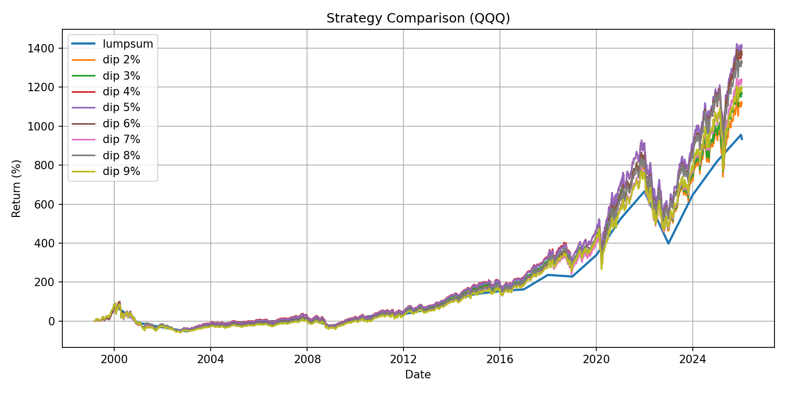

# Nasdaq Backtest – QQQ投資戦略分析

QQQ（NASDAQ100 ETF）の過去価格データを用いて、
複数の長期投資戦略をバックテストし、パフォーマンスを比較するプロジェクトです。

以下の戦略を比較しました：

- 年初一括投資（Lump Sum）
- 一定割合下落時に定額購入する Dip Buy 戦略

各戦略についてリターンおよび最大ドローダウンを比較しています。

---

## 戦略比較結果



---

## 使用技術

- Python
- pandas
- matplotlib
- yfinance
- SQLite

---

## 実行方法

```bash
source .venv/bin/activate
python -m src.main
```
