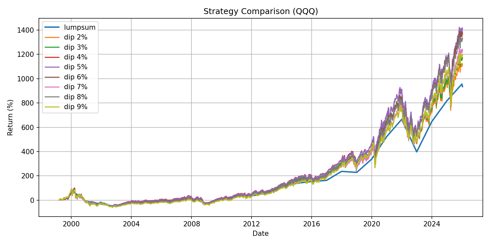
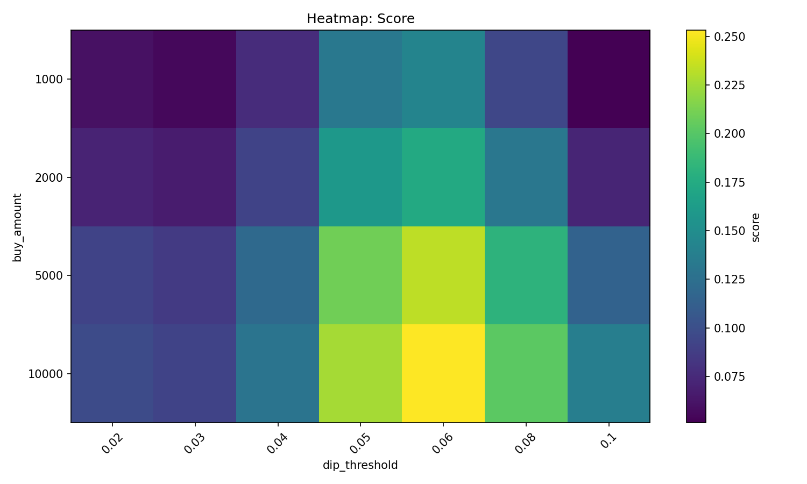
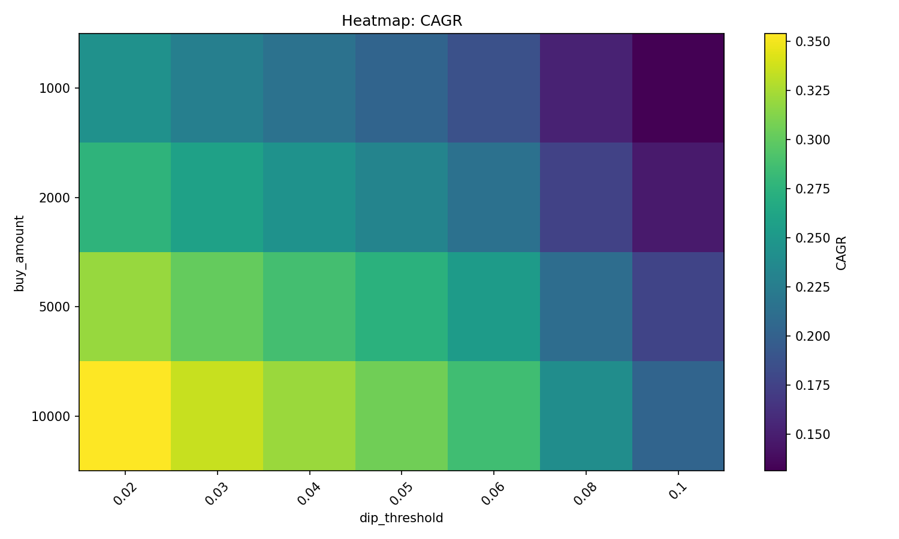
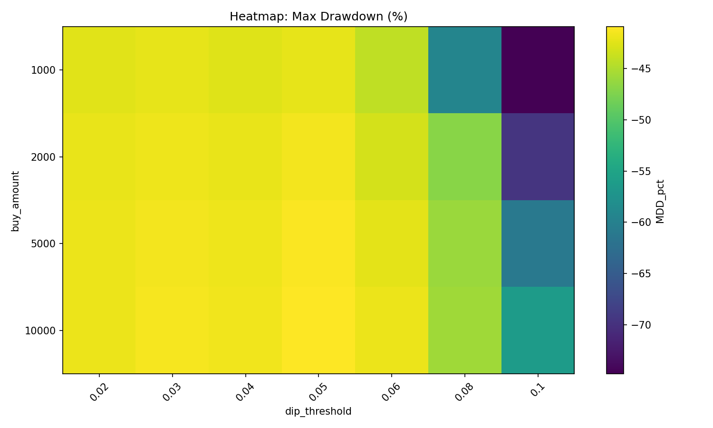
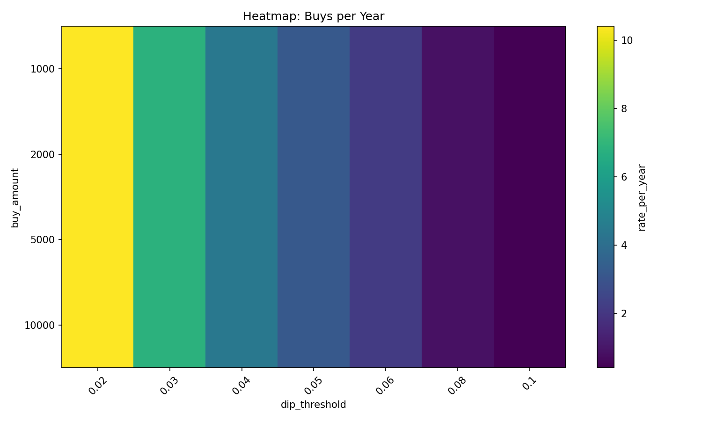

# Nasdaq Backtest – QQQ投資戦略分析

QQQ（NASDAQ100 ETF）の過去価格データを用いて、  
複数の長期投資戦略をバックテストし、パフォーマンスを比較・最適化するプロジェクトです。

---

## 概要

以下の戦略を比較しました：

- 年初一括投資（Lump Sum）
- 一定割合下落時に定額購入する Dip Buy 戦略

各戦略について、リターンおよび最大ドローダウン（MDD）などの指標で比較しています。

---

## 戦略比較結果（Lump Sum vs Dip Buy）



---

## グリッドサーチによるパラメータ最適化（Dip Buy）

Dip Buy 戦略はパラメータ（例：下落率しきい値、購入額）を手動で決めると主観が入りやすいため、  
探索空間を定義して総当たり（グリッドサーチ）でバックテストし、最適な条件を探索できる機能を追加しました。

### 探索パラメータ（最小構成）
- `dip_threshold`：下落率しきい値（例：0.02〜0.10）
- `buy_amount`：追加購入額（例：1000 / 2000 / 5000 / 10000）
- `initial_amount`：初期投資額（固定）

### 評価指標（例）
- CAGR（年率リターン）
- 最大ドローダウン（MDD）
- 取引回数（年あたり購入回数の現実性）
- ユーザーの投資可能額に合わせた購入額の適合度（任意）

### 評価関数（概念）
リターン最大化だけでなくリスクや現実性も考慮するため、以下の総合スコアで比較しています。

score = (CAGR - λ×abs(MDD)) 
        × 取引頻度補正(買いすぎ・買わな過ぎを判定) 
        × 購入額適合度補正(ユーザーの投資可能額に合わせる) 

---

---

## ヒートマップによる可視化（最適領域の確認）

グリッドサーチ結果を2次元ヒートマップで可視化し、  
「最適な一点」だけでなく「安定してスコアが高い領域」が存在することを確認しました。

### Score Heatmap


### CAGR Heatmap


### Max Drawdown Heatmap


### Buys per Year Heatmap


---

## 使用技術

- Python
- pandas
- matplotlib
- yfinance
- SQLite

---

## 実行方法

```bash
source .venv/bin/activate

# 戦略比較（Lump Sum / Dip Buy）
python -m src.main

# グリッドサーチ（Dip Buy 最適化 + CSV出力）
python -m src.search.grid_search

# ヒートマップ生成（results.csv を可視化）
python -m src.analysis.heatmaps
```
---
##グリッドサーチ結果(top3抜粋)
 dip_threshold  buy_amount  initial_amount     CAGR    MDD_pct  final_value  total_invested  return_pct  n_trades     years  rate_per_year    score
          0.06       10000           10000 0.285922 -41.975336   855.907398            58.0 1375.702410        58 26.850103       2.148148 0.253279
          0.06        5000           10000 0.253945 -42.274663   435.297546            29.5 1375.584902        58 26.850103       2.148148 0.232837
          0.05       10000           10000 0.305899 -40.925910  1294.747073            86.0 1405.519852        86 26.850103       3.185185 0.225702

上位結果から、dip_threshold 0.05〜0.06付近に安定して高スコア領域が存在することが確認できました。
これは過剰売買を避けつつリターンを最大化できるバランス点であると考えられます。

※本結果は、MDDに対するペナルティ係数（λ）および投資余力（target_buy_amount）の設定に依存する。
          
